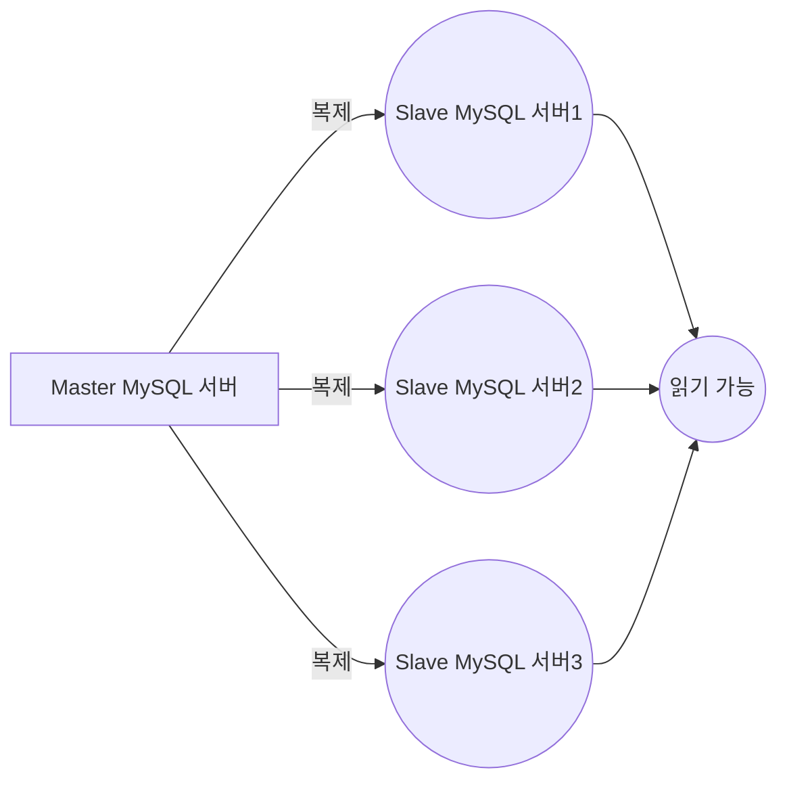

#mysql #database 

**참고**
- https://rlawls1991.tistory.com/entry/MySQL-Replication#:~:text=MySQL%20Replication%EC%9D%B4%EB%9E%80%3F,Master%20%2F%20Slave%20%EC%9C%BC%EB%A1%9C%20%EB%90%98%EC%96%B4%EC%9E%88%EB%8B%A4
- [[MYSQL] Replication 이란? (tistory.com)](https://sanghye.tistory.com/38)
- [MySQL :: MySQL 8.0 Reference Manual :: 17 Replication](https://dev.mysql.com/doc/refman/8.0/en/replication.html)
- [MySQL Replication(복제) - 단방향 이중화 (tistory.com)](https://server-talk.tistory.com/240)

### What is MySQL Replication?
- Replication은 복제를 뜻하며 2대 이상의 DBMS를 나눠서 데이터를 저장하는 방식입니다.
- 사용하기 위한 최소 구성은 **Master / Slave** 으로 되어있습니다.
- 기본적으로 비동기적으로 작동됩니다.
- 설정에 따라서, 모든 데이터베이스, 선택된 데이터베이스, 심지어 데이터베이스의 특정 테이블만 복제할 수 있습니다. 

**master**
- 웹서버로 부터 데이터 등록/수정/삭제 요청시 바이너리로그(Binarylog)를 생성하여 Slave 서버로 전달
- 웹서버로 부터 요청한 데이터 등록/수정/삭제 기능을 하는 DBMS로 많이 사용
**slave**
- Master DBMS로 부터 전달받은 바이너리로그(Binarylog)를 데이터로 반영
- 웹서버로 부터 요청을 통해 데이터를 조회하는 DBMS로 많이 사용

### Why MySQL Replication?

데이터 백업
- Master 서버에서 입력, 수정등이 발생했을 때 해당 데이터를 Slave 서버로 전달합니다. 
- 따라서 Master 서버에 장애가 생겨도 Slave 서버를 변경할 수 있습니다. 
DBMS의 부하분산
- 사용자의 폭주로 인해 1대의 DB서버로 감당할수 없을때, MySQL 리플리케이션(Replication)을 이용하여 같은 DB 데이터를 여러대를 만들수 있기에 부하를 분산하수 있습니다.

### MySQL Replication 구축해보기
